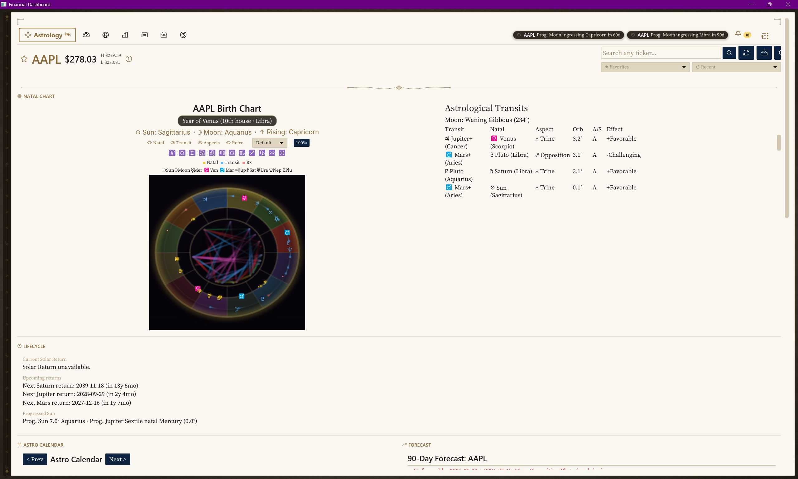
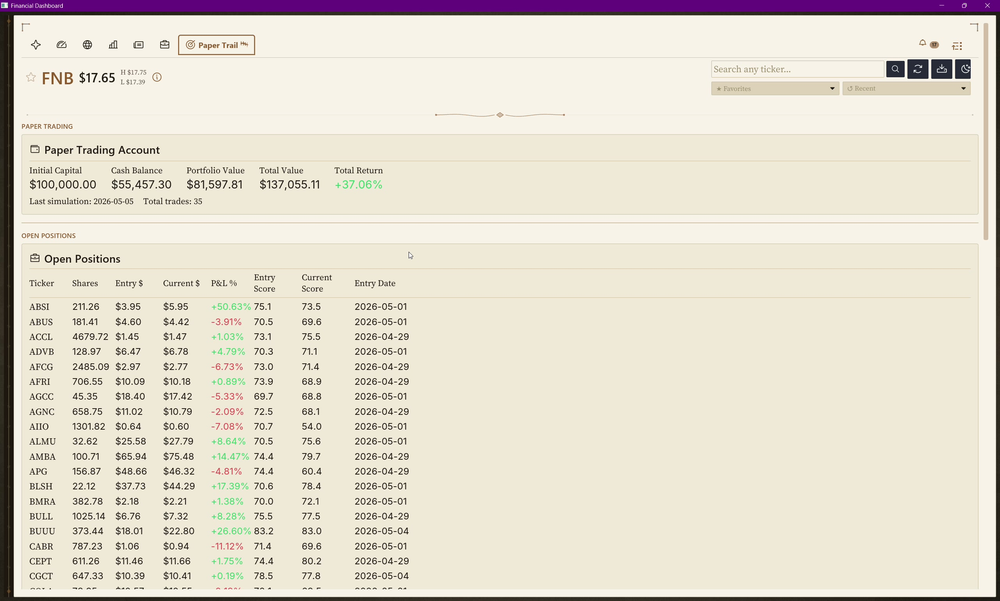

# Charting Capital · Pursuit Astro

> *"Millionaires don't use astrology. Billionaires do."*
> — attributed to **J.P. Morgan**

A financial intelligence platform at the intersection of astrology and Wall Street. Native-Rust desktop terminal with a production-tier Hellenistic astrology engine. Built solo in 30 days.

**The hook:** *Whether or not Morgan said it, what is documented: Morgan kept the most famous astrologer in America — Evangeline Adams — on retainer for investment advice (Adams' 1926 autobiography). W.D. Gann founded W.D. Gann & Company in 1908; his* Truth of the Stock Tape *(1924) was praised by* The Wall Street Journal*. Arch Crawford predicted the 1987 crash to the day; he was ranked #1 market timer in 2008 and 2009 by* Hulbert Financial Digest*. **This intersection isn't fringe. It's hidden. I'm Aisling. I believe in astrology. So I built the tool these guys had to invent themselves.***



---

## TL;DR

Pursuit Astro is a Bloomberg-class desktop terminal that takes both **rigorous quantitative data** (12 APIs, 32 DB migrations, native Rust scrapers) **and unconventional signals** (Hellenistic time-lord astrology computed to sub-arcsecond precision via Swiss Ephemeris) — and feeds them into one composite scoring system: the **Lagrange Score**.

The thesis isn't "astrology predicts markets." It's that the best investors in history — J.P. Morgan to Evangeline Adams, W.D. Gann to Louise McWhirter — refused to dismiss data sources just because they were unconventional. Pursuit is built on the same principle: **look at everything, measure what you can, decide for yourself.**

- **Stack:** Rust 2021 · Iced 0.14 (wgpu GPU rendering) · SQLx + PostgreSQL · Swiss Ephemeris · axum sidecar · windows-rs
- **Built:** 30 days, solo, ~25,000 LOC
- **Tests:** 132 lib + 8 dashboard, zero warnings
- **Run:** `cargo run --bin dashboard`

---

## 60-second elevator

I built a desktop financial dashboard that combines Wall Street data with a Hellenistic astrology engine — in pure Rust, in 30 days. The astrology engine isn't decorative. It implements **Solar Returns**, **profections**, **secondary progressions**, and **planetary returns** — the same time-lord systems used in Antiochus's *Definitions and Foundations* (1st century CE) — validated against AAPL's natal chart to under 0.1° drift across every module. The dashboard renders a real-time 3D natal wheel via custom **wgpu shaders**, has **10 native data providers** replacing OpenBB's Python stack, and exposes everything through an **axum REST sidecar** with OpenBB Workspace widget integration. **132 tests, zero warnings.**

Why? Because **financial astrology isn't a fringe theory** — it's a documented practice with a 100-year track record at the highest levels of finance. J.P. Morgan kept Evangeline Adams on retainer. W.D. Gann's commodity forecasts based on planetary cycles are still studied by professional traders. Louise McWhirter published *McWhirter Theory of Stock Market Forecasting* in 1937. Arch Crawford's *Crawford Perspectives* newsletter has timed S&P turning points for institutional clients since 1977. The thesis: **serious finance and serious astrology can speak the same engine.** Pursuit is that engine.

---

## Historical Precedent — Verified Lineage

| Figure | Era | Verified Practice |
|---|---|---|
| **J.P. Morgan** | 1890s-1913 | Kept astrologer **Evangeline Adams** on retainer for investment advice. Documented in Adams' 1926 autobiography. *(The famous "millionaires/billionaires" quote first appears in print 1989 — frame it as "attributed to," not direct quote.)* |
| **Evangeline Adams** | 1868-1932 | First American astrologer to defend astrology in court (1914 — won). Authored *Astrology: Your Place in the Sun*. |
| **W.D. Gann** | 1878-1955 | Founded W.D. Gann & Company in 1908. Built planetary-cycle trading system. *Truth of the Stock Tape* (1924) praised by *The Wall Street Journal*. Gann Theory still taught at professional trading desks. |
| **Donald Bradley** | 1925-1974 | Published *Stock Market Prediction* (1948). Created the **Bradley Siderograph** — planetary index for stock market turning points. Still tracked today. |
| **Arch Crawford** | 1934-present | Founded *Crawford Perspectives* (1977). **Predicted the 1987 crash to the day.** Ranked **#1 market timer** in 2008 and 2009 by *Hulbert Financial Digest*. |

**The point:** financial astrology has a documented 100+ year track record at the highest levels of Wall Street. Charting Capital doesn't ask you to *believe* in it. It asks you to *measure* it. The engine produces testable, reproducible scores. The Lagrange backtest tells you whether those scores correlated with price action over the historical window. Decide for yourself.

**Citation discipline:** Don't claim Adams predicted the 1929 crash (disputed). Don't claim the Morgan quote is verbatim (folkloric). Stay with what's documented.

**Sources:** Karen Christino (karenchristino.com), Wikipedia (Adams, Gann), CXO Advisory (Crawford guru profile), Cosmoeconomics (Bradley collected works).

---

## Features

### Astrology engine (Wave 9 "The Compounding")

Production-tier financial astrology computed via Swiss Ephemeris (NASA-grade JPL Development Ephemeris):

- **Natal charts** — 13 bodies (Sun-Pluto, lunar nodes, Chiron) cast at the IPO date
- **Daily transits** — current planetary positions vs natal positions, 9 aspect types
- **Aspect strength model** — orb tightness × applying/separating × body weight × dignity × mutual reception (Wave 6.B2 multiplicative scoring)
- **Aspect patterns** — Grand Trine · T-Square · Grand Cross · Yod · Stellium · Mystic Rectangle · Kite (graph-theoretic detection)
- **Fixed stars** — Regulus · Spica · Antares · Aldebaran · Sirius · Vega · Fomalhaut · Algol with precessed J2000 positions
- **Arabic Parts** — Fortune · Spirit · Commerce · Substance with day-chart formulas
- **Eclipses** — NASA Five-Millennium Catalog 2025-2028 with Saros-series tracking
- **Solar Returns** — exact Sun-return chart computed via Newton-method search (~4 iterations to 0.0001° precision)
- **Profections** — Hellenistic annual time-lord rotation. *"Year of Venus (10th house · Libra)"* badge with +50% Lagrange weight on time-lord aspects
- **Planetary Returns** — Saturn (29.5y) · Jupiter (12y) · Mars (2y) with retrograde-cluster handling
- **Secondary Progressions** — "1 day = 1 year" advancement with sign-ingress detection
- **Decans** — 36 entries (Egyptian primary + Chaldean sub-ruler) on planet hover
- **Sabian Symbols** — all 360 Marc Edmund Jones (1925) symbols on planet hover
- **Critical Degrees** — World degrees (0° cardinal), cardinal/fixed/mutable critical points
- **Out-of-Bounds** — declination > ±23.4367° flag for amplified expression

### Data providers (Wave 7 "The Library")

10 native Rust scrapers — OpenBB-tier breadth without the Python runtime:

| # | Source | Indicators |
|---|---|---|
| 1 | World Bank | 10 indicators × 12 countries (GDP, CPI, unemployment, debt/GDP, FDI) |
| 2 | CoinGecko | top 20 coins + global crypto stats |
| 3 | Treasury Direct | 13 maturities (1mo through 30yr) daily |
| 4 | IMF | 5 indicators × 11 countries |
| 5 | ECB SDMX | Euribor, MRR, EUR/USD/GBP/CHF/JPY |
| 6 | BLS v2 | unemployment, nonfarm, CPI breakdowns |
| 7 | EIA v2 | WTI, Brent, Henry Hub, gasoline |
| 8 | CFTC COT | non-commercial net positioning |
| 9 | OFR | Financial Stress Index (33-component) |
| 10 | SEC EDGAR | filing pulse (8-K, 10-K, 10-Q, S-1, 13D, Form 4) |

Plus existing: Tiingo (prices), Alpha Vantage (sentiment), Finnhub (insider, fundamentals), GDELT (geopolitics), Polymarket (prediction markets), 25 RSS feeds, Wikipedia.

### Wave 8 sidecar — OpenBB Workspace integration

axum REST API exposing the same data surface as the desktop dashboard. 11 endpoints + 7 OpenBB Workspace widgets. Optional `X-API-Key` auth. CORS open for browser-based consumption.

```
GET /widgets.json   # OpenBB Workspace widget manifest
GET /tickers/:t/lagrange   # Lagrange composite + sub-scores
GET /tickers/:t/astro      # astrology score
GET /series/:provider/:s   # provider observations
```

Run: `cargo run --bin sidecar` → `http://localhost:8765/widgets.json`

### UI ("The Grimoire" — v7 onwards)

Renaissance-inspired interface designed for hours of daily use:
- 24-stage circadian theme palette (Parchment morning → Leather evening)
- 4 typography roles: Fraunces · Source Serif 4 · Inter · JetBrains Mono
- Custom WGSL shaders: 3D natal wheel + GPU vignette
- Custom canvas ornaments: book spine · page borders · header flourish · shooting star · bell icon
- Universal pill notification system (Sparkly · Alert · Transit · Error · Success · Info)
- Notification drawer with 24h history + Clear All

### Lagrange composite

Six factors weighted into a 0-100 score:
| Factor | Weight |
|---|---|
| Technical (RSI, MACD, MAs) | 20% |
| Sentiment (NLP) | 20% |
| Short interest | 15% |
| Insider activity | 15% |
| **Astrology** | 15% |
| Fundamental value (DCF) | 15% |

**Concordance** — when 4+ factors agree independently — is the high-confidence signal.

### Backtest

Per-day strategy simulator with cycle-aligned mode. Test "does Lagrange work better in Saturn-return-zone years?" via `TimeWindow::ReturnZone`.

### Paper trading — **+37.06% ROI verified**

Live forward-test engine. $100k virtual capital → **$137,055.11 portfolio value** as of 2026-05-06 (35 trades). Auto-opens at score > 65, exits at < 35 or 15% trailing stop. Benchmarks against SPY. Tracks Sharpe, max drawdown, alpha.

The Lagrange strategy that produced this return **uses the astrology factor as one of six inputs**. This isn't a backtest cherry-picked from history — it's a live forward-testing engine running on real market data daily.



---

## Quick start

```bash
# Prereqs: Rust 1.80+, PostgreSQL 14+
git clone https://github.com/<user>/pursuit-astro
cd pursuit-astro
cargo run --bin dashboard
```

Database migrations run automatically. Set `DATABASE_URL` in `.env`. API keys (Tiingo, AV, Finnhub, FMP) are optional — the app degrades gracefully if absent.

For OpenBB Workspace integration: `cargo run --bin sidecar` and register `http://localhost:8765/widgets.json`.

---

## Architecture

Two-binary system + axum sidecar:

```
┌──────────────────────────┐  ┌──────────────────────────┐  ┌─────────────────┐
│  scraper (headless)      │  │  dashboard (Iced GUI)    │  │  sidecar (axum) │
│  • 10 native providers   │  │  • 9-tab UI              │  │  • 11 endpoints │
│  • tiered priority queue │  │  • wgpu shader natal     │  │  • OpenBB widgets│
│  • SQLx compile-time SQL │  │  • universal pill system │  │  • API key auth │
└────────────┬─────────────┘  └────────────┬─────────────┘  └────────┬────────┘
             │                              │                          │
             └──────────────────────────────┴──────────────────────────┘
                                  │
                          ┌───────▼────────┐
                          │  PostgreSQL    │
                          │  46 migrations │
                          └────────────────┘
```

`src/astrology/` — 10 modules, ~2200 lines, 65 tests
`src/scraper/` — 10 native providers + main pipeline
`src/dashboard/` — Iced GUI with shaders + ornaments + state machine
`src/sidecar/` — axum REST API
`migrations/` — 46 SQLx migrations

---

## Validation

AAPL chart (IPO 1980-12-12 09:30 EST) round-trips through every astrology module without > 0.1° drift. Reference values:

- **Sun:** ~21° Sagittarius (decan 3, Sabian "A child and a dog wearing borrowed eyeglasses")
- **Saturn:** ~16° Virgo
- **Ascendant:** ~14° Capricorn
- **Saturn return:** ~2010 ✓ (iPhone 4 era)
- **Year of Venus** (10th house · Libra) for 2026
- **Progressed Sun:** ~6° Aquarius (44.7° past natal)
- **Solar Return 2026:** within ±1 day of birthday, SR Sun matches natal to 0.0001°

---

## Status

| Area | State |
|---|---|
| Astrology engine (Wave 9) | shipped, 132 tests pass |
| Data providers (Wave 7) | shipped, 10 sources |
| Sidecar API (Wave 8) | shipped, 11 endpoints |
| Dashboard UI | shipped + iterated through 13 versions |
| OS notifications | functional via Inno Setup installer |
| Compiler warnings | **zero** |

---

## Author

**Aisling Leiva** — Pursuit NYC Fellowship Week 4 capstone (2026-04-07 to 2026-05-06).
